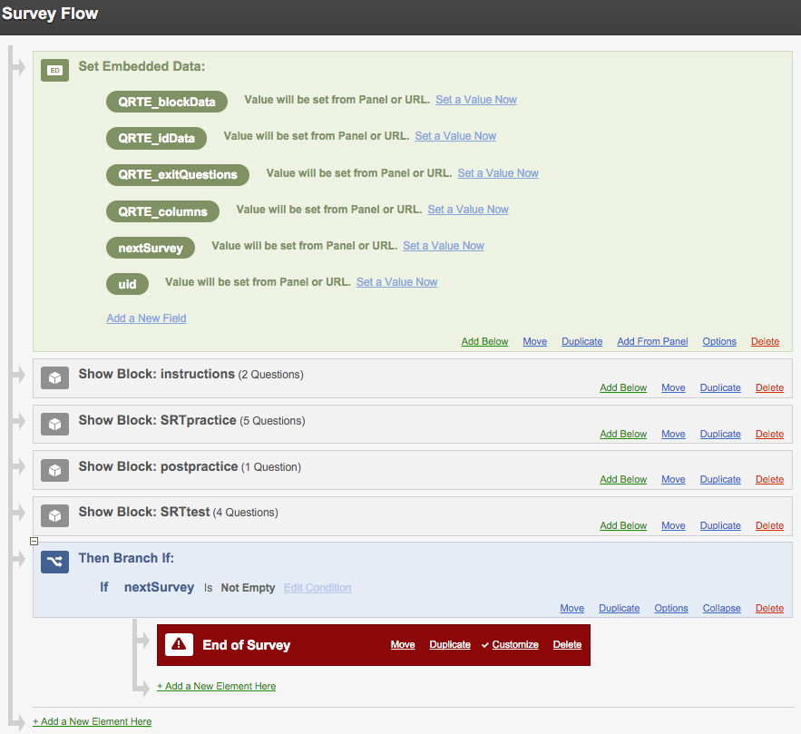

# Importing

Working with a single survey is the easiest place to start. In general, you create your survey in Qualtrics, Activate it (in the distribution tab), and make the unique survey link available to whoever you would like to complete it.

The **qrtenginer** compatible tests come premade for you, meaning you can import them as ready-to-use or make certain adjustments. There are two files for each **qrtenginer** compatible test. One is a Qualtrics survey file called something like *surveyName.qsf*, and the other is a Microsoft excel document called *surveyName_LoopMergeData.xls*. To get such a test into your own Qualtrics account, go to <http://www.qualtrics.com/> and Log in to your Qualtrics account. Under the *My Surveys* tab, click on *Create Survey* as shown below.

When prompted with the message *How would you like to create your survey?* click on the *Quick Survey Builder* box to create a new blank survey. Give the survey an appropriate name and put it in a folder if you wish (I like to have all surveys for a particular research project in their own folder).

In the new blank survey, click on *Advanced Options* and then *Import Survey...* from the drop-down menu.

In the window that appears, click *Choose File* and locate your *.qsf* file. Once you've selected your file, click *Import*.

The survey should now populate itself with the ready-to-use elements. That is, you can immediately Activate the survey and distribute it for collecting data. Every time the survey is completed, there will be a unique identifier stored in the data called `ResponseID`.

# Adjusting

Sometimes you might want to make adjustments to the default survey settings. For example, you might want to reduce the number of practice questions, or add new test questions. When you import a **qrtenginer** compatible test, you are likley to see two or three blocks with the names `instructions`, `practice`, and `test` (sometimes with the test name before them). An example for a task switching test is shown below:

Blocks with the title `instuction` can be adjusted freely. That is, you can change the text as you see fit.

For the remaining blocks (`practice` and `test`), changes can be made to Loop & Merge data. **QRTEngine** surveys use the Loop and Merge function of Qualtrics to create the test content. You can view this data by clicking the green and black "Loop & Merge Text" button on the block (see above). At first, the content of the Loop & Merge window might appear confusing. This is what the excel file that comes with your test is for. This file contains the default Loop & Merge data (and sometimes extra information), along with headers for each data column. You can adjust the Loop & Merge data in one of two ways. (1) Make the adjustment manually in Qualtrics, or (2) adjust the excel file, then copy and paste the excel table (without headers) directly into the Qualtrics Loop & Merge data section. I highly recommend approach (2).

# Chaining

Everything so far is reasonably straightforward, buta single test is rarely enough for us to conduct a full research project. Typically, we want people to compelte multiple tests and surveys. This is where *chaining* comes in. *Chaining* is a term used by the package and tests author (Simon A Jackson) to refer to the linking of multiple Qualtrics surveys.

## Why chain?

People often ask "why can't I just create a single survey with everything?". In some circumstances, yes, you can create a single large survey. However, there are certain advantages to maintaining separate surveys for each test or questionnaire you wish to administer. One issue with single surveys is that Qualtrics slows down as the survey gets larger. This can really expand your development time and become very frustrating when just deleting a question or changing a bit of text takes a considerable amount of time. The other issue with single ssurveys is that **QRTEngine** has a number of requirements that can become difficult to maintain. For example, every **QRTEngine** block and exit question must have a unique name. Once you start adding **QRTEngine** tests into a single survey, this can get tricky. Furthermore, the mass of data outputted by such a survey can become unwieldy. The final major reason is that accidents happen. When people are doing your surveys, browsers crash, batteries die, and all sorts of other interuptions occur. If you can be certain that every person will complete your entire list of surveys on a single and unique device, then a single survey can be used with saving enabled. But, if you anticipate accidents, and that multiple people could use the same device, or that a single person could use multiple devices, then separate surveys will save you a lot of headache during the data collection phase. We'll cover these issues below.

## Chaining requirements

There are some challenges to chaining. They usually mean more work upfront, but, as discussed above, far less work down the track. There are two major requirements for chaining:

- We need a unique identifier to be passed between surveys so we can link peoples data across multiple surveys.
- At the end of a survey, we need a way of sending them to the next survey.

The **qrtenginer** tests are setup to handle these requirements with relative ease. This document will outline how you can make use of these features (and how to imlement them yourself) to chain multiple Qualtrics surveys.

## Embedded data

Both of these requirements are overcome through the use of Embedded data fields. If you're unfamiliar with these, have a look at the [Qualtrics tutorial on embedded data](http://www.qualtrics.com/university/researchsuite/advanced-building/survey-flow/embedded-data/).

### Unique Identifier (`uid`)

The embedded data field `uid` is used to store a Uniue Identifier about the person completing the survey. This could be a student number, experiment id, etc. Anything that is unique to the person and, preferrably, something easy to type. Every **qrtenginer test** contains a `uid` embedded data field. You can see it by viewing the Survey Flow (under the Edit Survey tab). At the top of the Survey Flow, you should see something like the following (notice `uid` at the bottom).

We can set this variable using the URL of the survey. Say you activate your survey and get the link: https://qualtrics.com/?SID=cweyig. We could send this to people to complete the survey, and everything will work. When you download the data, each row will have a unique response ID created by Qualtrics, but the `uid` column will be empty (or filled with NA). But what if the same person completed the test more than once, or what if, as mentioend before, we need to link this to another survey?

To fill in the `uid`, we need to make a change to the URL. Specifically, we need to add "&uid=xxx" to the end, and replace xxx with something unique about the person we're sending it to. To demonstrate, say you want to send the test to Simon and Elliot. You could send them the following:

- https:/qualtrics.com/?SID=cweyig&uid=simon to Simon
- https://qualtrics.com/?SID=cweyi&uid=elliot to Elliot

Now, when you download the data, you will see "simon" and "elliot" in the `uid` column.

This is all well and good, but it doesn't scale very well. Covered in the following section, the trick is to have participants type something unique about themselves, and have this passed automatically between your chained surveys so you don't have to create and send out multiple URLs.

### The Next Survey (`nextSurvey`)

The embedded data field `nextSurvey` is used to store the URL of the survey that should appear after the current one is finished. If this field is left blank, then the survey will finish like any normal Qualtrics survey (with a thank you and note that the response has been recorded). 

Say, for example, that at the completion of survey A, you'd like people to be taken to survey B. Carry out the following:

- Activate survey B and copy its URL.
- Return to survey A
- Open the survey flow
- Click "Set a Value Now" next to the `nextSurvey` embedded data field
- Paste in the URL of survey B.

Now, on the completion of survey A, the person will be automatically taken to survey B.

The icing on the cake is that it will pass any `uid` too. If I sent Simon a link to survey A with `&uid=simon` at the end, then they will be sent to survey B with this `uid` automatically added too! When the data for both surveys is downloaded, `uid` will contain "simon". It's now possible for us to chain multiple tests/surveys without the need to continuously make changes to the URL.

