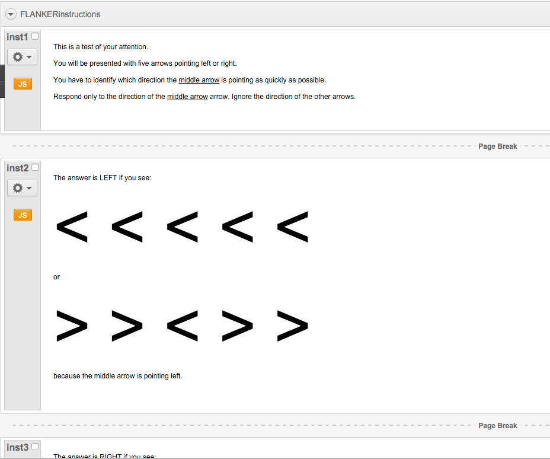
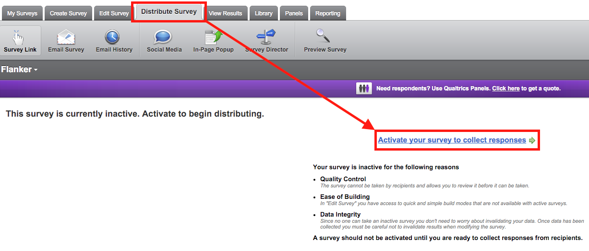
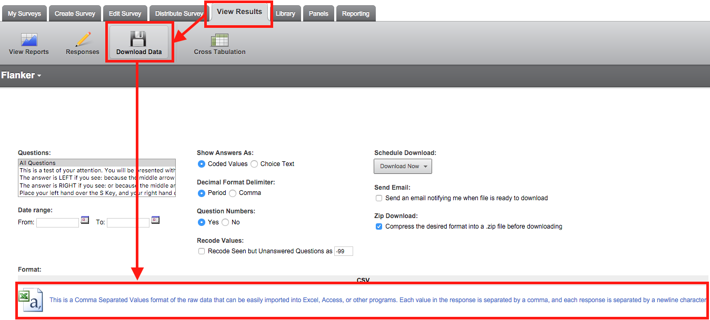
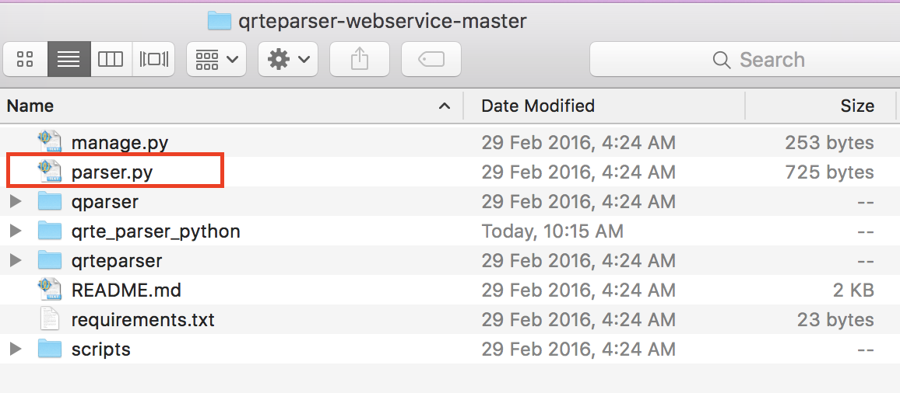
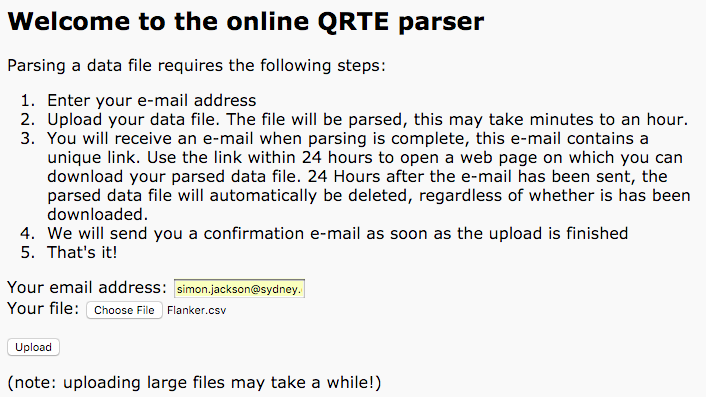

```{r, echo = FALSE}
# Set global knitr options
knitr::opts_chunk$set(collapse = TRUE, comment = "#>")
```

Start to finish, this document will takes you through the basic process of getting your QRTEngine tests running to producing information about your users.

As a reference, here's a summary of the steps that you'll take:

1. Import and activate your test in Qualtrics.
2. Gather data.
3. Download data in .csv format as a .zip file from Qualtrics.
4. Extract your .csv file from this .zip.
5. Upload this file to QRTEngine's online parser at <https://parser.qrtengine.com/>
6. Download the parsed file when QRTEngine email you with link.
7. Make sure you have **R** and **qrtenginer** installed on your computer.
8. Run the following in **R** (with correct file paths):

```{r, eval = FALSE}
library(qrtenginer)
d <- extractQrteGz("/path/to/YourParsedFile_out.csv.gz")
write.csv(scoreQrte(d), "/path/to/save/your/testResults.csv", row.names = FALSE)
```

# Intro to **qrtenginer**

The [qrtenginer](https://github.com/drsimonj/qrtenginer) package helps to parse and analyse data from tests (or surveys) created in [Qualtrics](http://www.qualtrics.com/) with [QRTEngine](http://www.qrtengine.com/), using [R](https://www.r-project.org/).

This package provides two sets of functions for:

- Parsing and extracting data from any QRTEngine test.
- Scoring variables from raw data of compatible tests created by the package author, Dr Simon A Jackson.

For many users of this package, only the parsing and extracting functions will be used. Others, however, who have access to the author's compatible tests, can make use of the scoring functions. This primer will use one of the author's compatible tests as an example. If you do not have access to these tests, simply replace them with your own QRTEngine test, and feel free to stop reading at the section about calculating variables.

### Summary of qrtenginer workflow

(1) Use **Qualtrics** to create a **QRTEngine** test and gather data
(3) Use **qrtenginer** to parse data in R into a readable tabular format
(4) Use **qrtenginer** to calculate variables

# Qualtrics

This package would be useless without having created a test using a [Qualtrics](http://www.qualtrics.com/) survey that makes use of [QRTEngine](http://www.qrtengine.com/). This primer will use the author's Flanker task as an example. To follow exactly, you will need the author's *Flanker.qsf* file. If you do not have this, or another *qrtenginer* compatible test provided by the author, create your own [QRTEngine](http://www.qrtengine.com/) test and follow along as appropriate.

## Importing the test

This section will describe how to import the the *Flanker.qsf* file. If you do not have this (or another of the author's compatible tests), create your own QRTEngine survey and go to section on [Gathering data](#gatherData).

If you do have a compatible file like the *Flanker.qsf* file, go to <http://www.qualtrics.com/> and Log in to your Qualtrics account. Under the *My Surveys* tab, click on *Create Survey* as shown below.


When prompted with the message *How would you like to create your survey?* click on the *Quick Survey Builder* box to create a new blank survey. Give your survey a name (e.g., "Flanker") and put it in a folder if you wish.

In your new blank survey, click on *Advanced Options* and then *Import Survey...* from the drop-down menu.


In the window that appears, click *Choose File* and locate your compatible Qualtrics file (e.g., *Flanker.qsf*). Once you've selected your file, click *Import*.

Your survey should now look something like the picture below and be ready to use.



## Gathering Data {#gatherData}

Now that you have your QRTEngine survey in Qualtrics, it's time to gather data. Open the *Distribute Survey* tab and click *Activate your survey to collect responses*.



After some loading time, you should see an Anonymous Survey Link. Make this link available to people to complete your test. Once some people have done your test, you are ready to move on to the next section.

## Downloading your data

Now that you have some data, it's time to download it from Qualtrics for analysis. To do this, click on the *View Results* tab, then the *Download Data* button, and finally download your data as comma separated values file (.csv) by clicking *This is a Comma Separated Values format...*. You can leave all the other options as is.



This can take a moment. When done, Qualtrics will downloaded a zip file to your computer. This concludes our time in Qualtrics, and signals the start of our move to the **qrtenginer** package.

# Installing qrtengine

Although we won't need it just yet, we will soon need to use the **qrtenginer** package in **R**. This section will explain how to install the necessary software to use **qrtenginer**. Note that you will only need to complete this section once. That is, once you've installed these software packages, you can run as many QRTEngine tests and use **qrtenginer** as often as you like without having to redo this step.

The first thing you need to install is **R**. I'd also recommend downloading and using **RStudio**, but this isn't absolutely necessary. To download and Install **R**, go to <https://cran.r-project.org/mirrors.html>, select a link for the location closest to you, and then click the link to *Download R for* your operating system (Linux, Mac, or Windows). Follow the prompts to download and then install **R**.

If you want, once you have **R**, you can download and install **RStudio** from <https://www.rstudio.com/products/rstudio-desktop/>. Select the option to *DOWNLOAD RSTUDIO OPEN SOURCE DESKTOP*. Once downloaded, go ahead and install **RStudio** on your computer.

Next, open **R** (or **RStudio**). You'll now be typing commands into the R Console to download and install **qrtenginer**. [qrtenginer](https://github.com/drsimonj/qrtenginer) is hosted as a development package on Dr Simon Jackson's Github account. For R to download and install such a package, it will need another package called `devtools`. So first thing to do is type `install.packages("devtools")` into the console (next to `>`) and hit the enter key. Give **R** some time to download this package. When you see `>` appear again, you're ready to continue. If you encounter an error saying `trying to use CRAN without setting a mirror...` then type the following instead `install.packages("devtools", repos="http://cran.rstudio.com/")`.

We only need to download packages like this onto our computer once. However, just because it's on our computer, doesn't mean that **R** can use it. Every time we want to use a package, we need to tell **R** we want to use it. So, to use `devtools`, run the `library()` command as follows:

```{r}
library(devtools)
```

Now that `devtools` is available to **R** for use, we can download and install **qrtenginer**. To do this, run the following command in your console:

```{r, eval = FALSE}
devtools::install_github("drsimonj/qrtenginer")
```

All going well, you should now have **qrtenginer** installed on your computer. Again, you only need to complete this step once. To use it, however, we always need to run `library(qrtenginer)` before using any of its functions.

With **qrtenginer** installed, lets look at how to parse data.

# Parsing and extracting data into R

Recall that we now have a zip folder downloaded from Qualtrics that contains a .csv file with our data. However, this .csv is not in a useful format just yet. If you extract the .csv and open it, you won't find much that makes sense. This is because QRTEngine stores data in a format known as JSON. So the first thing we want to do is to parse this data into something we can understand.

Parsing QRTEngine data from JSON into something useable can be done in a few ways. At the time this primer was being written, there were three ways provided by QRTEngine: an online parser, a python parser, and a Java parser. You can view these at <http://www.qrtengine.com/downloads/>

You can follow the QRTEngine tutorials on their website for accomplishing this step yourself. However, **qrtenginer** is set up to help you accomplish this step to get your data straight into R for analysis. When it comes to using **qrtenginer**, two of the QRTEngine parsing methods can be integrated. The first is by having R do everything by using the python parser in the background. The second is by parsing the data yourself using the online parser, and then having R finish the job of extracting the data. There are pros and cons to both of these approaches. The python approach wins out in terms of efficieny. It will mean you can parse and score your data instantly. However, it requires some technical skill to get it set up. The online parser wins out in terms of usability, as no technical skills are required. However, this approach means you could be waiting from 1 seconds to 24 hours to get your data. For people without any programming skills, using the online parser is probably the best way to go. We'll cover both approaches here, but feel free to skip to the section about [using the online parser](#onlineParser) if you'd prefer a less technical solution.

## Using the python parser

At the time this primer was written, using the QRTEngine python parser required that you have Python 2.7 installed and running on your computer by default. You can download this from the python website at <https://www.python.org/downloads/>. Click on the *Download Python 2.7.11* (or whichever version of 2.7) and then install this file. The important point is that the QRTEngine python parser cannot make use of Python 3, so be sure to download and install a version of Python 2.7.

To check that you've installed this correctly, run the following command in *R*:

```{r}
system("python --version")
```

If you see *Python 2.7.11*, or some other version of python starting with 2.7, then you're good to go. If not, then you'll have to figure out a way to get Python 2.7 installed and running on your system by default. If you can't, then simple go to the instructions for [using the online parser](#onlineParser). The picture below shows what my terminal (on a Mac) looked like when checking this.

If this is all setup, the next thing you want to do is download the QRTEngine python parser. To do this, enter <https://github.com/ErwinHaasnoot/qrteparser-webservice/archive/master.zip> into your web browser. This will download a .zip file containing everything for the python parser. Extract this folder to somewhere accessible. Inside this folder will be a file called *parser.py*. Check this file is there and remember it.



We're now ready to parse our Qualtrics data.

Open an **R** console (or **RStudio** session). Make **qrtenginer** available by running:

```{r}
library(qrtenginer)
```

We're now going to make use of the **qrtenginer** function `parseQrte()`, which assumes that you have Python 2.7 running by default on your computer. This function takes two main arguements (pieces of information). One is the path to your .zip downloaded from Qualtrics. The other is the path to the *parser.py* file which can be found in the parser folder you downloaded and extracted from QRTEngine.

To demonstrate, I'll put the *Flanker.zip* and *qrteparser-webservice-master* folder on my Desktop (I'm currentlty working on a Mac). I'll now run the following command in R:

```{r}
d <- parseQrte("/Users/Simon/Desktop/Flanker.zip",
               "/Users/Simon/Desktop/qrteparser-webservice-master/parser.py")
```

Notice the structure of this command. I'll be detailed for those who are not familiar with **R**. `d <-` is telling **R** to create a variable called `d` and to save our data to it. We then want to run our function `parseQrte()`. Inside the brackets are our two arguements (pieces of information) separated by a comma. The order of these arguements is important. First comes the file path to our .zip downloaded from Qualtrics. Notice how it's wrapped in quotation marks. Then comes a comma. Then our second arguement, which is the path to QRTEngine's *parser.py* file. We can examine the structure of our data (saved as `d`) by running something like:

```{r}
str(d)
```

In my example, I have `r nrow(d)` rows (obs.) and `r ncol(d)` columns (variables). I can see these in the structure. They include things like `r colnames(d)[1:4]` and so on.

If you wish to look at your data as a complete table (e.g., like in excel or SPSS), the easiest thing is to use **RStudio** and run the command `View(d)`. If you're just using **R**, or struggling to make this work, you can save your data as a .csv and open it excel. For example, to save my data as a .csv to the dekstop as a file called `myQualtricsData.csv`, I need to run the following command: `write.csv(d, file = "/Users/Simon/Desktop/myQualtricsData.csv")`.

Our data is now in a more familiar and readable tabluar structure.

### Python parser summary

This approach assumes that you:

(1) Have Python 2.7 is installed on your computer
(2) Have downloaded and extract the python parser from QRTEngine.

If so, then, in R run the following commands (with correct paths):

```{r, eval = FALSE}
library(qrtenginer)
d <- parseQrte("path/to/Qualtrics/data.zip", "path/to/QRTEngine/parser.py")
```

## Using the online parser {#onlineParser}

Using the online parser can be easier than using the python parser, but can take longer. With the python parser, once you have python installed and the QRTEngine python parser, you only need to run two lines of R code and you're set. The way the online parser works is that QRTEngine host a parser online, so you can upload your data to their website, and they email you a link where you can download a parsed, but compressed, file. Once we have this file, **qrtenginer** will uncompress it for us and get it into a nice useable format for **R**. The easy part is that we don't need to have anything like python installed on our computer.

To use this approach:

(1) Extract the .csv from the .zip you downloaded from Qualtrics.
(2) Go to <https://parser.qrtengine.com/>
(3) Type in your email address and select the extracted .csv file.
(4) Once you've done this, click *Upload*.

It should look something like this:



You'll then recieve a couple of emails from QRTEngine. At this point, you'll have to wait for one with a Subject line like *[QRTEParser] Successfully parsed YourFileName.csv*. This email usually comes quite quickly (almost immediately), but can take up to 24 hours accoring to QRTEngine. The email will contain a link you can paste into a browser and click *Download parsed data file* to download a .csv.gz file. Take careful note of the file name. It will be the same as your .csv, but with "_out" added and also ".gz" at the end.

Place this file somewhere accessible and open R. I'll place it on my desktop and run the following commands:

```{r}
library(qrtenginer)
d <- extractQrteGz("/Users/Simon/Desktop/Flanker_out.csv.gz")
```

and check that this worked:

```{r}
str(d)
```

We now have the same result we got using the python parser.

Again, if you wish to look at your data as a complete table (e.g., like in excel or SPSS), the easiest thing is to use **RStudio** and run the command `View(d)`. If you're just using **R**, or struggling to make this work, you can save your data as a .csv and open it excel. For example, to save my data as a .csv to the dekstop as a file called `myQualtricsData.csv`, I need to run the following command: `write.csv(d, file = "/Users/Simon/Desktop/myQualtricsData.csv")`.

### Online parser summary

(1) Extract your .csv file from the .zip downloaded from Qualtrics.
(2) Upload this file to QRTEngine's online parser at <https://parser.qrtengine.com/>
(3) Download the parsed file when QRTEngine email you with link.
(4) Run the following in **R** (with correct file):

```{r, eval = FALSE}
library(qrtenginer)
d <- extractQrteGz("/path/to/YourParsedFile_out.csv.gz")
```

# Calculating variables

This section outlines how to calculate useful variables from your data provided that you are using a test created by the author that was intended to be used with the **qrtengine** package. If you do not have such a test, then it will be up to you to calculate variables from your data now stored in the object `d`. You can ignore this section, though you might find reading it useful to gain an idea of how **qrtenginer** calculates variables. If you did use one of the compatible tests, then read on. This section also assumes that you've parsed the data as instructed above, and now have an object `d` (or equivalent) storing your data as a tabular structure.

## Quick calculation

For convenience, this section will first describe how to calculate variables. It won't go into any detail about how the variables are calculated.

Calculating variables is done with the function `scoreQrte()`. For all compatible tests, you can just put your data object (`d` for us) as the arguement in this function and you're done. For example:

```{r}
scoreQrte(d)
```

If you want to export these results as a .csv to use in programmes like excel or SPSS, add this to the `write.csv()` function with a file path to save to (for programmes like SPSS, it's also best to take out the row names). For example, to write the results to my Desktop without row names:

```{r, eval = FALSE}
write.csv(scoreQrte(d), "/Users/Simon/Desktop/Flanker_results.csv", row.names = FALSE)
```

and that's it!

### Variable calculation summary

So, say you've gathered data, here's a summary of going from Qualtrics to a .csv of variables (to be used in programmes like excel or SPSS) using the online parser:

1. Download data in .csv format as a .zip file from Qualtrics.
2. Extract your .csv file from this .zip.
3. Upload this file to QRTEngine's online parser at <https://parser.qrtengine.com/>
4. Download the parsed file when QRTEngine email you with link.
5. Make sure you have **R** and **qrtenginer** installed on your computer.
6. Run the following in **R** (with correct file paths):

```{r, eval = FALSE}
library(qrtenginer)
d <- extractQrteGz("/path/to/YourParsedFile_out.csv.gz")
write.csv(scoreQrte(d), "/path/to/save/your/testResults.csv", row.names = FALSE)
```

Done!

## Scoring in detail

Whether we used the python parser or the online parser, we now have a variable in **R** called `d`, which is storing our data in a tabular structure. The way the QRTEngine works means that each row in the table is a single trial/item completed by participants. My data set has `r nrow(d)` rows. But how many people completed the test? The column in our data that we're interested in is `ResponseID`. This holds the unique ID that Qualtrics assigns to someone when they complete our test.

So we can look at all the unique IDs in our data set with:

```{r}
unique(d$ResponseID)
```

My data set has 3 unique IDs, meaning that three complete responses had been collected by Qualtrics at the time I downloaded the data.


---------

For the Flanker test used in this example, we can see a number of columns outputted by this function:

- `mean.rt`    : The mean/average reaction time for valid responses (responses not counted as anticipatory or a lapse).
- `n.valid`    : The number of valid responses from which the mean was calculated.
- `n.anti`     : The number of responses so fast they were counted as anticipatory. By default, these are responses faster than 100ms.
- `n.lapse`    : The number of responses so slow they were counted as a lapse. By default, these are responses slower than 500ms.
- `ResponseID` : Unique participant ID assigned by **Qualtrics**.
- `Congruency` : Whether the other variables (`meant.rt`, `n.valid`, `n.anti`, `n.lapse`) are calculated for congruent or incongruent trials.
- `Simulus.ACC`: Whether the other variables (`meant.rt`, `n.valid`, `n.anti`, `n.lapse`) are calculated for correct (1) or incorrect (0) responses.

The Flanker test has congruent and incongruent trial types (`Congruency`). Also, people can be correct or incorrect (`Stimulus.ACC`). Finally, we're interested in the reaction time. How many times they were so fast that we count them as anticipatory (`n.anti`), or so slow that we count it as a lapse (`n.lapse`). Finally, for all the times that the response was valid (not anticipatory or a lapse, `n.valid`), we want to know the average response time (`mean.rt`). The other column we have is the unique ID of our participant: `ResponseID`.

So, from the results above, we can in row 1 that the participant with ID `r scoreQrte(d)$ResponseID[1]` has a mean response time of `r round(scoreQrte(d)$mean.rt[1], 4)` for `r scoreQrte(d)$Congruency[1]` trials on which he or she was `r ifelse(scoreQrte(d)$Stimulus.ACC[1] == 1, "right (ACC = 1)", "wrong (ACC = 0)")`.

In **R**, you can split the data up by ID to see it more easily for each person by running:

```{r}
split(scoreQrte(d), scoreQrte(d)$ResponseID)
```

From this, it's easier for us to see that the first person has been much faster when responding correctly to congruent trials (`r round(scoreQrte(d)$mean.rt[2], 4)`) than when responding correctly to incongruent trials (`r round(scoreQrte(d)$mean.rt[4], 4)`).
