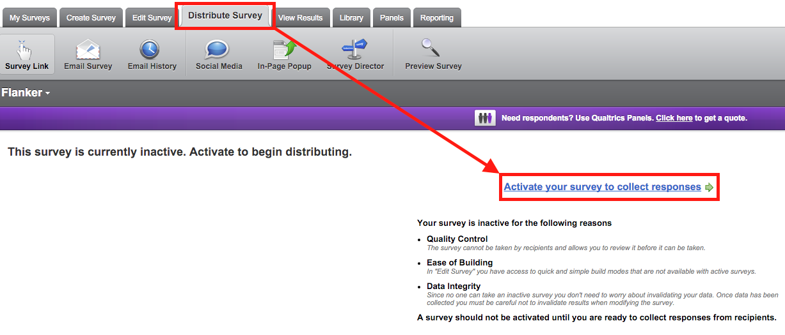

Setting up your surveys properly in Qualtrics is not directly related to the **qrtenginer** package, but making the greatest use of the **qrtenginer** compatible tests is integral to a successful research project. This document will provide a step-by-step instruction guide for setting up a battery of the **qrtenginer** tests using the default settings. For an indepth explanation of the features that can be adjusted or used, see the `detailed-survey-setup` vignette.

# What you'll need

- A Qualtrics account
- The `id-info-and-consent.qsf` file
- The `.qsf` files for all **qrtenginer** tests you wish to use.

# Importing

Go to <http://www.qualtrics.com/> and Log in to your Qualtrics account. For each `.qsf` file (including `id-info-and-consent.qsf`), do the following:

1. Go to the *My Surveys* tab and click *Create Survey*.

2. When prompted *How would you like to create your survey?* click *Quick Survey Builder* to create a new blank survey. Give the survey an appropriate name and put it in a folder if you wish (it's strongly recommended that you place all surveys for the particular research project into a single folder).

3. In the new blank survey (under the *Edit Survey* tab), click on *Advanced Options* and then *Import Survey...* from the drop-down menu.

4. In the window that appears, click *Choose File* and locate your *.qsf* file. Once you've selected your file, click *Import*.

5. Under the *Distribute Survey* tab, click *Activate your survey to collect responses*.

6. Record the name of the survey and *Your Anonymous Survey Link* somewhere (e.g., in an excel or text document).

Repeat these steps for ALL  `.qsf` files you wish to use (including `id-info-and-consent.qsf`).

# Adjust `id-info-and-consent.qsf`

During the research, participants must first complete The `id-info-and-consent.qsf` survey to obtain a Unique Identifier (`uid`) and elicit consent for participating in the research. Once imported, it should look something like this:

The following features **CANNOT** be changed in this survey:

* The first field in the `ID` form question must collect a unique identifier.
* The Javascript in the `INFO` question must *not* be removed.
* The yes/no choice in the `CONSENT` question must remain unchanged.
* The `ID` and `CONSENT` questions must force a response.

The following elements can, and usually should, be changed:

* The number and names of the form fields in the `ID` question.
    + You can change the text `Experiment ID` to anything else (e.g., `student ID`), provided that this first field collects something unique about the person.
    + After this field, you can add or remove as many form fields as you like (e.g., to collect date of birth or age, email addresses).
* The question text presented in the `INFO` and `CONSENT` questions.

# Chaining Surveys

Next, decide on the order in which you would like people to complete your surveys. Note, however, that the `id-info-and-consent.qsf` survey needs to come first.

For convenience, arrange your record of test names and their corresponding URLs in this order, starting with `id-info-and-consent.qsf`.

Starting with `id-info-and-consent.qsf`, in order, do the following:

1. From your record, copy the URL of the **next** survey to appear after the completion of the current survey.

2. In Qualtrics, under the *Edit Survey* tab, open the current survey and click *Survey Flow*.

3. In the green section titled *Set Embedded Data*, locate the field `nextSurvey`.

4. Click *Set a Value Now*.

5. Paste in the URL of the next survey (copied in step 1).

Repeat this for all surveys except the last (for which no changes need to be made).

# Collecting Data

Now, to collect data, provide people the URL for the `id-info-and-consent.qsf` survey. They will complete this survey, and be automatically directed through the remaining surveys in the order you prepared. When you download the data for each survey, a `uid` column will be available representing the Unique Identifer of the person completing the survey. This will contain the person's answer to the first `ID` form question in the `id-info-and-consent.qsf` survey.

See the primer vignette for handling data with the **qrtenginer** package.

# Handling errors

Errors happen. The browser can crash, the device can lose power or disconnect from the internet, and so on. For these reasons, it often becomes necessary to get a person started from a particular survey rather than the beginning. In some cases, the simple solution can be to refresh the browser page. If this doesn't work or is not possible, read on.

To have someone start from a particular test, enter the test URL into a browser window and add `&uid=xxx` to it, replacing 'xxx' with the person's Unique Identifier (`uid`), that they would have answered as the first question in the `id-info-and-consent.qsf` survey.

To demonstrate, say that a participant who was assigned the Experiment ID `p100` (which is what they typed in the `id-info-and-consent.qsf` survey) was half way through the experiment when their device crashed. The participant had just started a test whose URL is `https://qualtrics.com/SID=aa11`. To get the participant working on this test again, open a web browser, and type the following into the address bar: `https://qualtrics.com/SID=aa11&uid=p100`. Notice the addition of `&uid=p100` at the end. The participant can then complete this test, have their Unique Identifier (`p100`) recorded, and will be directed to the next survey as normal.
